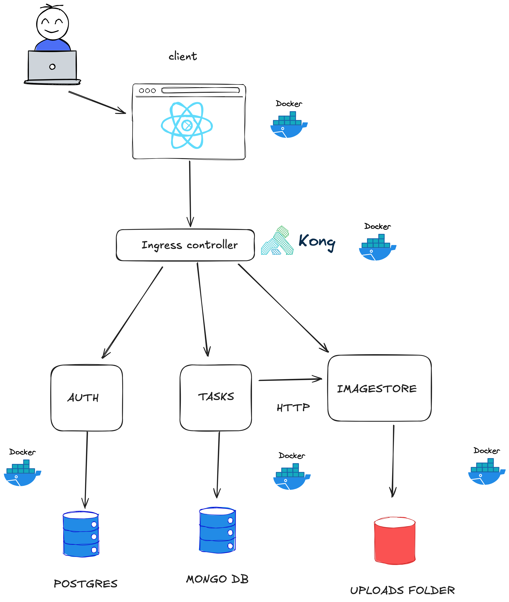

# Trabajo Práctico Final – Programación Web III

Esta aplicación web está inspirada en Reddit y simula una plataforma donde los usuarios pueden publicar contenido, visualizar posteos y gestionar imágenes.

---

## 🧠 Descripción General

La app sigue una **arquitectura de microservicios orientada a contenedores**, integrando múltiples tecnologías modernas. Los servicios se comunican mediante **Kong API Gateway**, permitiendo una estructura escalable y mantenible.

Los roles disponibles son:

- **Suscriptor**: puede ver contenido público. Los usuarios nuevos registrados ingresan con este rol por defecto.
- **Administrador**: puede crear y eliminar publicaciones, además de acceder a funciones adicionales de gestión.

---

## 🎯 Funcionalidades principales

- Autenticación con JWT
- Registro de nuevos usuarios (rol suscriptor)
- Gestión de tareas (posteos tipo Reddit)
- Subida y visualización de imágenes
- Frontend responsivo en React
- Comunicación entre microservicios a través de Kong

---

## 🧱 Arquitectura



| Componente     | Tecnología              | Descripción                             |
|----------------|-------------------------|-----------------------------------------|
| API Gateway    | Kong                    | Controlador de entrada y enrutamiento   |
| Auth Service   | Node.js + TypeScript    | Manejo de usuarios y JWT (PostgreSQL)   |
| Tasks Service  | Node.js + JavaScript    | Post tipo Reddit (MongoDB)              |
| Imagestore     | Go                      | Subida de imágenes (almacenamiento local) |
| Frontend       | React + Vite            | Interfaz de usuario                     |

---

## 🖥️ URLs del frontend

Una vez levantado el proyecto:

- 🌐 **Frontend web**: [http://localhost:5173](http://localhost:5173)

---

## 🧪 Usuarios para login

Puedes:

- ✅ **Crear un nuevo usuario** desde el formulario de registro. Este se creará como **suscriptor** por defecto.
- ✅ O iniciar sesión como **administrador** con este usuario de prueba:

```bash
📧 Email: admin@example.com
🔐 Contraseña: 123456
